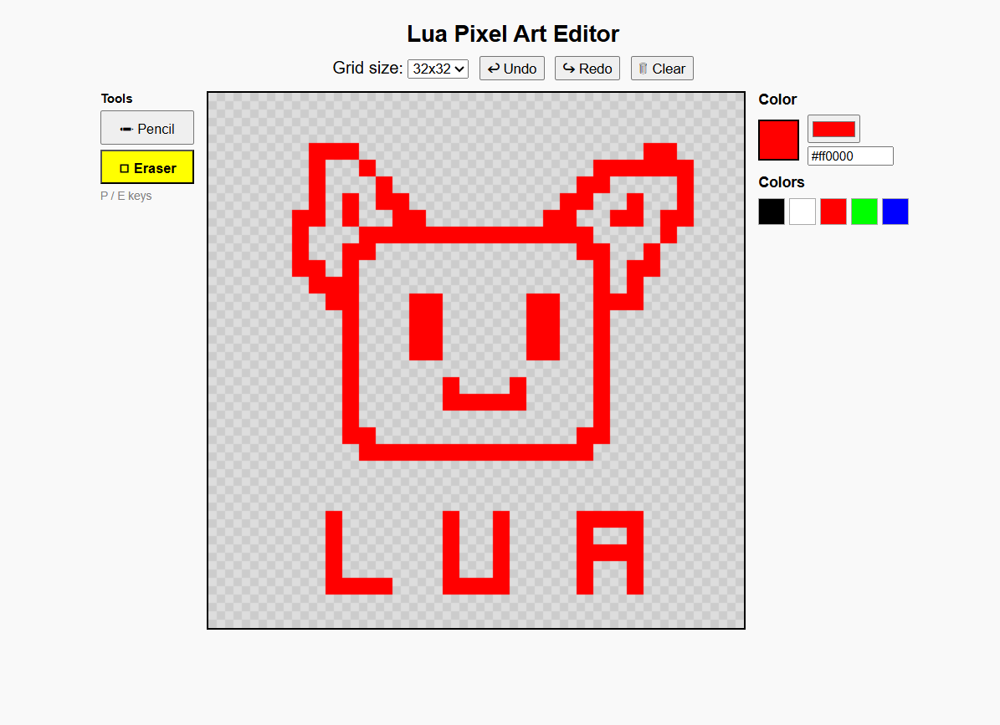

# Lua Pixel Art Editor

A really simple, browser-based pixel art editor



---

## Features

### Drawing Tools

- **Pencil** : draw pixels one by one or drag to paint freely
- **Eraser** : remove pixels by clicking or dragging

### Grid Sizes

Choose between **8×8**, **16×16**, **32×32** (default), **48×48**, and **64×64** grids depending on how detailed you want your artwork.

### Color Picker

- Native **color picker** input for full color selection
- **Hex input field** : type any hex code directly (e.g. `#ff6600`)
- **Current color preview** box always visible
- **Quick color palette** with 5 preset colors (black, white, red, green, blue)

### Undo / Redo

- **Undo** : go back up to 80 steps
- **Redo** : restore undone actions
- History is reset when the grid size changes

### Canvas

- Checkerboard background to visualize transparent pixels
- Canvas scales automatically with the selected grid size

---

## Keyboard Shortcuts

| Key                             | Action           |
| ------------------------------- | ---------------- |
| `P`                             | Switch to Pencil |
| `E`                             | Switch to Eraser |
| `Ctrl + Z`                      | Undo             |
| `Ctrl + Y` / `Ctrl + Shift + Z` | Redo             |

> Shortcuts are disabled when typing inside an input field.

---

## How to Use

1. Open `index.html` in any modern browser or visit https://lua.gabintavernier.com
2. Select a grid size from the dropdown
3. Pick a color using the color picker or type a hex code
4. Choose a tool (Pencil or Eraser)
5. Click or drag on the canvas to draw
6. Use Undo / Redo to fix mistakes
7. Click 🗑 **Clear** to reset the canvas (asks for confirmation)

---

## Tech Stack

| Layer     | Technology                   |
| --------- | ---------------------------- |
| Markup    | HTML5                        |
| Styling   | CSS3 (vanilla, no framework) |
| Logic     | JavaScript (vanilla ES5/ES6) |
| Rendering | HTML5 Canvas API             |

and all that in 1 html file lmfao

---

## Project Structure

```
lua/
└── index.html   # entire app : markup, styles, and logic in one file
```

---

## Roadmap / Ideas

- [ ] Export as PNG
- [ ] Fill bucket tool
- [ ] Color history / recently used colors display
- [ ] Save / load from localStorage
- [ ] Zoom in / out
- [ ] Symmetry mode

---

## License

MIT : do whatever you want with it lol.
